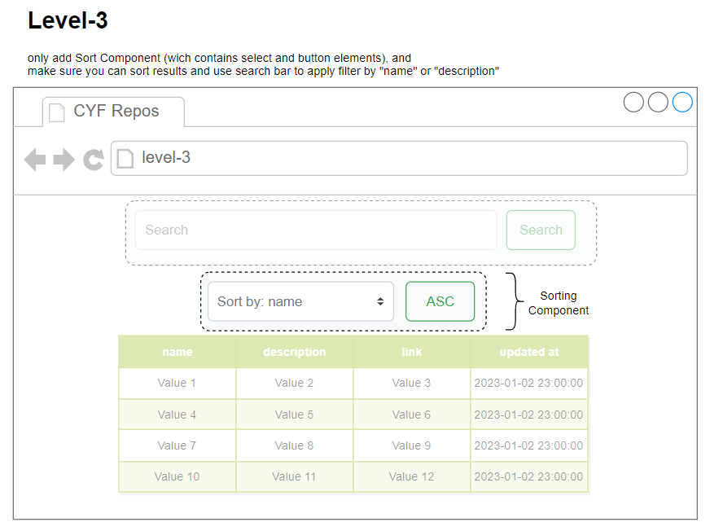
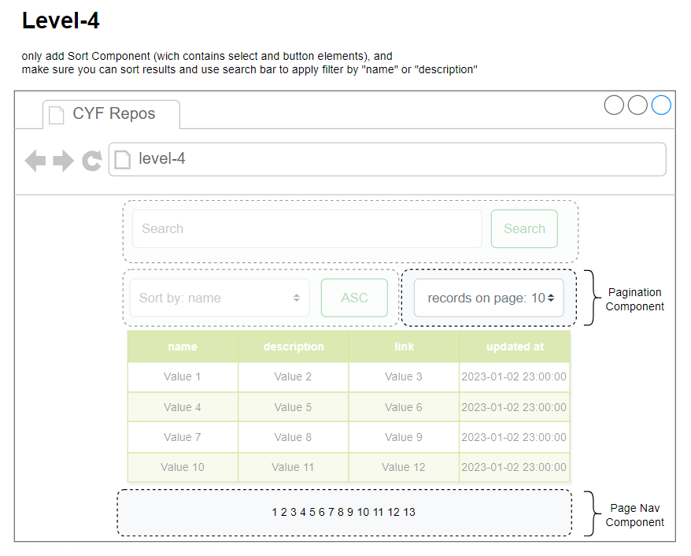

# CYF Repos

Here is a small starting template for you to practice with DOM in JS.

## What you need to do:
What you've got is a Github's API response in `/data/repos.js` file. 

You task is to build a table with the list of repos and their links to them. 

You are not supposed to create any static HTML content in `index.html` file. Use only [DOM API](https://developer.mozilla.org/en-US/docs/Web/API/Document_Object_Model) in JavaScript when creating and adding new HTML Elements. You can also have preset styles in `/css/styles.css`.

When builing the table, it's preferable to use `css grid` for rendering table.

## Task steps:
Final result should look somewhat like shown at this image:  
  
100% match is not required though.

We can decompose the implementation in 4 stages as below:
<ul> 
    <li>
        <b>Level 1</b>:
        

            Build table of repos out of the `repos`
        

        

            here is how it might look like:
             
            
        

        

            Try using <a href="https://css-tricks.com/snippets/css/complete-guide-grid">CSS Grid</a> for building table, if possible.
        

    </li>
    <li>
        <b>Level 2</b>:
        

            Implement searching functinality. There must be a text field that accespts a user input text, and event hadler for it when user presses Enter key to apply filter by the entered words found in `name` or `description`.
        

        

            <b>Note</b>, <i>you don't need HTML Form element on you page to make your buttons and input fields work. Use button and input controls as is, because we don't need to send any data to elsewhere, we only need to process clicks and other user inputs and respond to that accordingly</i>.
        

        

            Here how is the mock design for this stage might look like:
             
            
        

    </li>
    <li>
        <b>Level 3</b>:
        

            Implement sorting functionality. There should be a drop down select element with sorting options: `sort by: name`, `sort by: updated date`. 
            And there should be a button next to the drop down, that switches direction between `ASC` (Ascending) and `DESC` (Descending). 
        

        

            Default value is "ASC". 
             
            If user clisks this button it should switch to "DESC".
             
            On the next click it should switch back to "ASC" and so on...
        

        

            Here is the mock:  
             
            
        

        

            Your applicatin at this point shold have this structure:
             
            
             
            <i>This is an example for guidance only. You might come up with a better idea, though ;)</i>
        

    </li> 
    <li>
        <b>Level 4</b>
        

            Implement pagination functionality. There should be a drop down select element with a multiple available options for the number of table rows on the page: `10`, `20`, `50`, `100`. If you implement pagination, please add also page control element at the bottom of the page with links `next`, `previous`, `1`, `2`, `3`, etc...
             
        

        

            Here is the mock:
             
            
        

        

            Your applicatin at this point shold have this structure:
             
            
             
            <i>This is an example for guidance only. You might come up with a better idea, though ;)</i>
        

    </li>
</ul>

## If you want to know more:
If you are interested how to get the full data from Github API refer to this link: [Repositories](https://docs.github.com/en/rest/repos/repos?apiVersion=latest).

You can use your browser for querying Github API or more convenient tool: [Postman](https://www.postman.com/downloads/). Here is an examsple of GET request end-point: https://api.github.com/orgs/CodeYourFuture/repos?per_page=100&page=4.

For more information check [Github Repositories API](https://docs.github.com/en/rest/repos/repos?apiVersion=latest). 

To access Github's API you'd need to get [Access Token](https://github.com/settings/tokens?type=beta) and use it with [Possman](https://www.postman.com/downloads/) or `curl` cmd in Bash Console.

